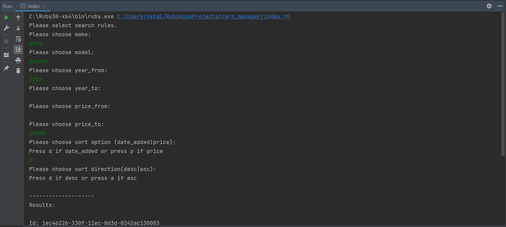
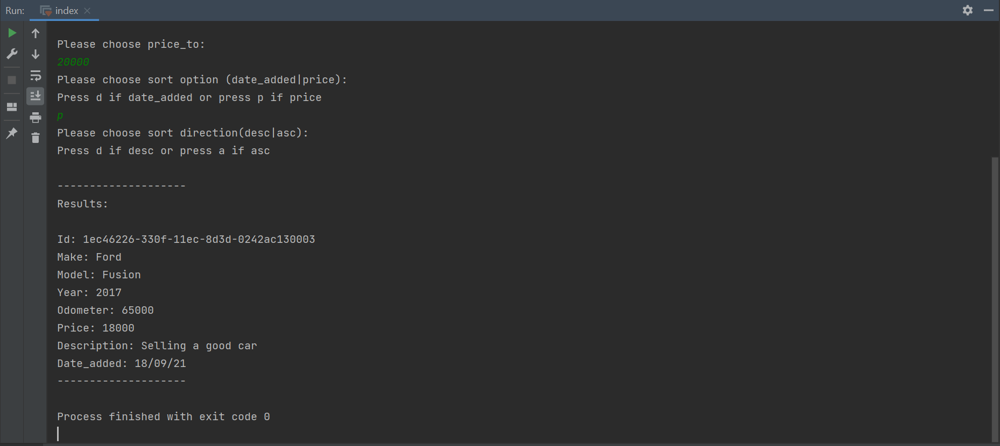

# Cars search
Сonsole application for displaying cars cars from the database with the specified parameters
## Task
* The app must have the ability to load all data from the db (db.yml).
* The app must have the ability to search by rules: 
    - Searching rules: **make**, **model**, **year_from**, **year_to**, **price_from**,
      **price_to**.
    - Rules must be combined with logical **AND**.
    - Each rule must be asked in the console.
    - If the user wants to skip the search rule, he enters an empty line.
* The app must have the ability to apply sorting for search results.
    - Sort option must be asked in the console.
    - Sort options: **price**, **date_added**.
    - Sort directions: **asc**, **desc**.
    - If the user wants to skip the sort option or direction he enters an empty
      line.
    - The default sort option is **date_added**.
    - The default sort direction is **desc**.
    - If user passed unexpected value – it should be similar to the behavior
      when user passed nothing.
    
## Description

Task is implemented on:  **Ruby 3.0.2**

Language: **English**

Database: **cars.yml**(https://gist.github.com/Svatok/bd80ffb7d34969262e5a65579e3a0d86)

## How to set up this project
1. Make sure that you have 3.0.2 version of Ruby. 
> ruby -v
2. Clone respected git repository.
> git clone https://github.com/vr242kj/cars_management.git
3. Run index.rb file.
> ruby index.rb

## Results

